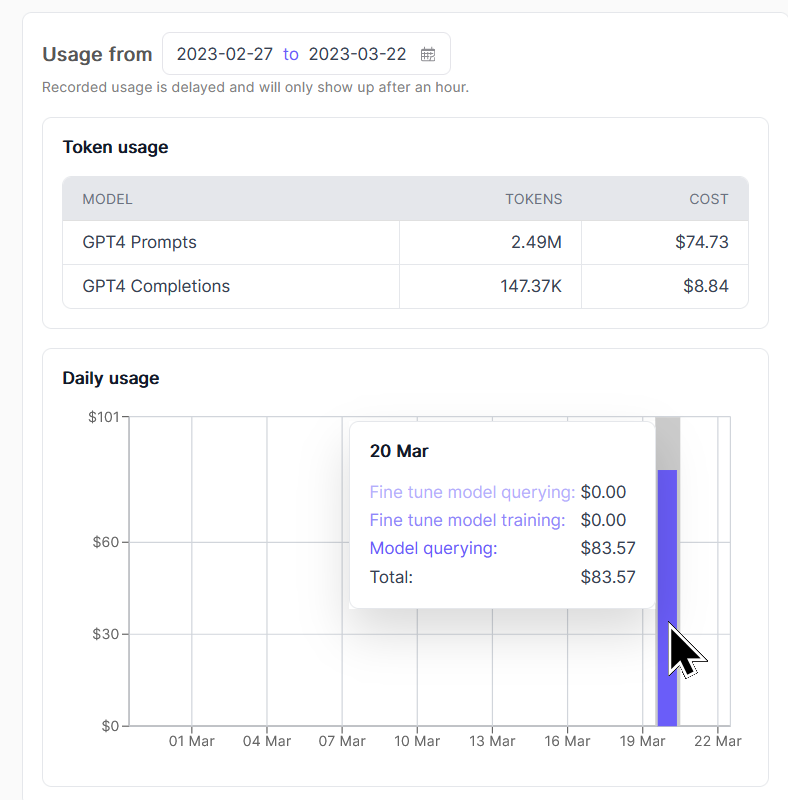

it's over.


## high score
 

# TavernAI scale spellbook
quick hack to get tavernai to work with spellbook.scale.com for playing around with GPT4. based off of [cncanon1's](https://github.com/CncAnon1/) existing OpenAI mod.

---

## 🚨Important -- Security
Some newer versions of TavernAI (1.3.0, 1.3.1) are susceptible to a serious vulnerability when loading malicious character cards (https://github.com/TavernAI/TavernAI/issues/93).  This fork (1.2.8) is not vulnerable to this particular exploit, but TavernAI's code is very messy and there is always the possibility that there are other undiscovered exploits. Use caution when loading character cards from sources you do not trust and verify the content using https://zoltanai.github.io/character-editor/.

For safety, I strongly suggest you do not allow public access to your TavernAI server under any circumstances. This fork is already configured in such a way by default, but you can confirm by checking `whitelistMode = true` in [config.conf](config.conf).  

Do NOT set `whitelistMode = false` unless you are absolutely certain your system is isolated in another way.

Consider using https://github.com/luminai-companion/agn-ai instead, which while being more complicated to set up, is a more robust piece of software.

[🚨중요 -- 보안 (한국어)](security-ko.md) / [🚨Важно -- Безопасность (Русский)](security-ru.md)

---

## Quickstart
If you don't want to set up any of the shit below, you can just download it and run. It is preconfigured to connect to a bot.  Just launch `Start.bat` to get started.  Node.js v18 is required. 

⚠️ **Beware that if you do not change the API key, I can see your degenerate prompts and I WILL read your ERP.** ⚠️ 

If you want your own private (lol) bot, follow the guide below.

## Configuration
- Create scale spellbook account at https://spellbook.scale.com.
- Create an "App" (name/desc doesn't matter)
- Create a "Variant", which sets the parameters (system prompt, model, temperature, stop sequence, respnse token limit, etc) for your bot
- **Make sure to select GPT-4, you retard**

- Replace the contents of the "User" section of the prompt with the following:
```
Complete the next response in this fictional roleplay chat.

{{ input }}
```
- 💡 Set the model parameters as desired.
  - **Model:** GPT-4
  - **Temperature:** ~0.6 - 0.9
  - **Maximum Tokens:** 400 - 4096
    - This controls the max length of the AI's responses, NOT the context size. ***If you set this to a very high value, you MUST adjust the "Max Response Size" value in TavernAI's settings to match!***
    - I recommend 300 - 500 for chat purposes. You don't want the AI sending you 4000 token chat messages.
- Click "Save New Variant"
- Go to your new Variant and click Deploy

- This will create an API key and URL for your bot.

- Launch the server using the command line by running `.\Start.bat`.
- Open the TavernAI sidebar, switch the API to "Scale", and paste your API key and URL in the boxes. Click "Connect".
- Now start having fun with GPT4 :)
